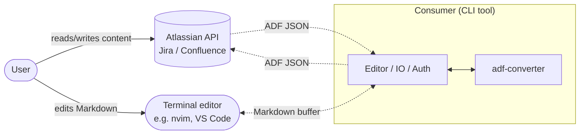
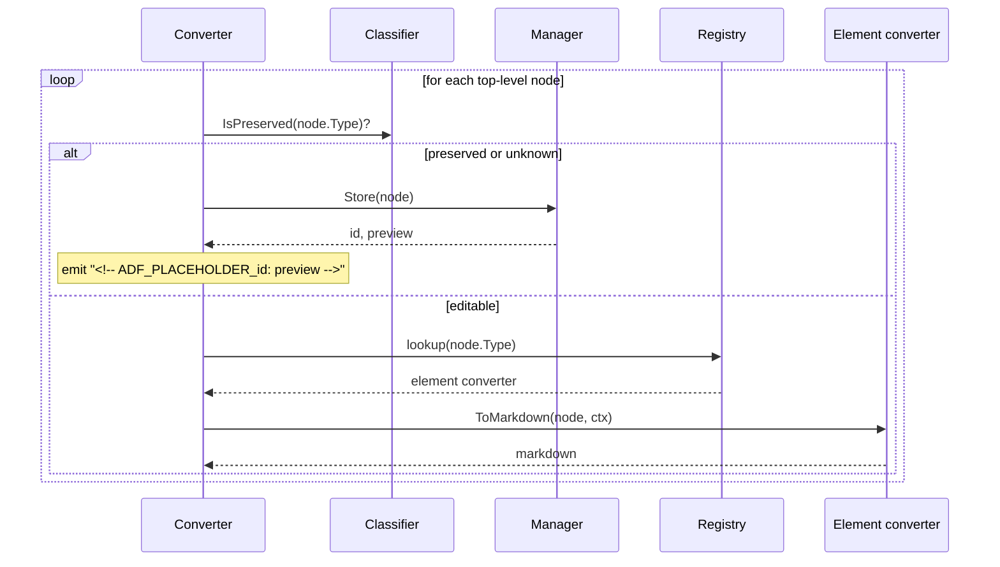
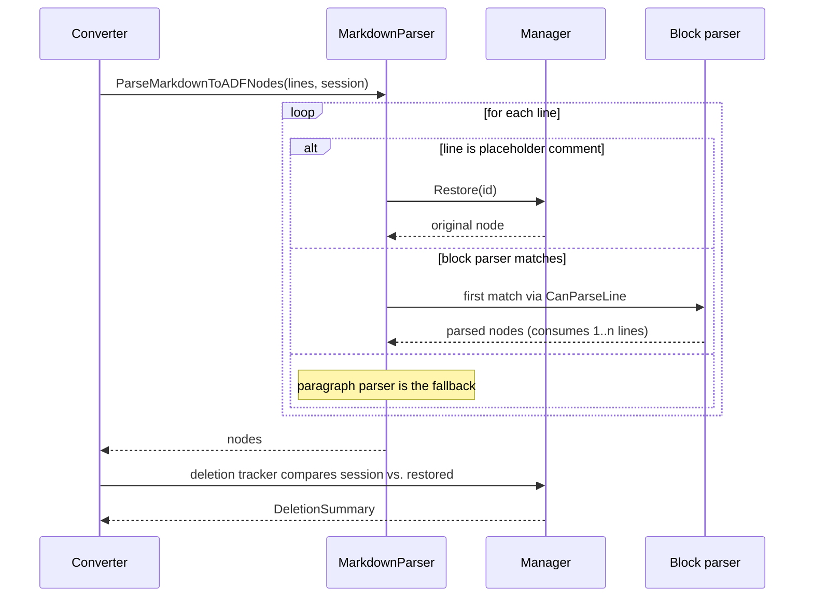
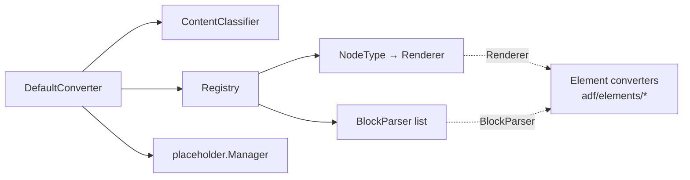
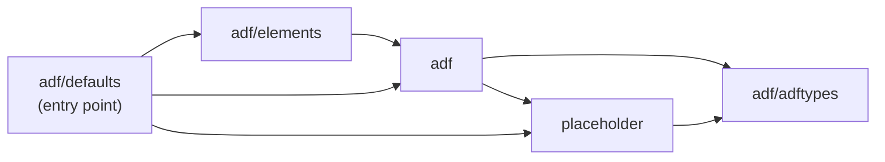

# Architecture: adf-converter

> Status: Draft. For ordinary use of the library, see [README.md](README.md).
> This document is for developers and power consumers.

## Table of Contents

1. [Purpose & Scope](#1-purpose--scope)
2. [Roundtrip Mechanics](#2-roundtrip-mechanics)
3. [How to Read this Document](#3-how-to-read-this-document)
4. [System Context](#4-system-context)
5. [Conversion Pipeline](#5-conversion-pipeline)
6. [Component View](#6-component-view)
7. [Extension Points](#7-extension-points)
8. [Design Principles](#8-design-principles)
9. [Testing Strategy](#9-testing-strategy)
10. [Non-Goals](#10-non-goals)
11. [Appendix A: Package Layout](#11-appendix-a-package-layout)
12. [Further Reading](#12-further-reading)

---

## 1. Purpose & Scope

`adf-converter` translates Atlassian Document Format (ADF) to Markdown
and back without losing information. The driving use case: terminal
tools that fetch a Jira or Confluence document from the REST API, let
the user edit it as Markdown, and write it back without breaking what
other authors wrote.

What's outside the scope:

- HTTP calls against the Atlassian API,
- filesystem IO,
- validation against the ADF schema,
- editor, TUI, or diff rendering.

IO, authentication, UI, and persistence belong to the consumer. That
boundary is intentional; see [System Context](#4-system-context).

## 2. Roundtrip Mechanics

The library handles three kinds of content, each taking a different
path through the conversion:

- **Editable content** such as text, headings, and lists round-trips
  through Markdown unchanged.
- **Non-editable content** such as media or layout structure is
  represented by an opaque placeholder in the Markdown. The library
  keeps the original aside and slots it back in on the reverse path.
- **Unknown content**, including future ADF additions the library
  does not yet recognize, takes the same placeholder path. Nothing is
  dropped, nothing breaks.

A converter that drops or downgrades content is a bug, not a
trade-off. Several other ADF libraries (`simple-adf-formatter`,
`pinpt/adf`, `adf-to-md`) downgrade unknown constructs to plain text.
This one keeps them.

There is one opt-in lossy mode: **display mode**. Consumers that only
need to read ADF, never write it back, can disable the placeholder
store. The roundtrip guarantee applies only when the store is active.

## 3. How to Read this Document

Different goals suggest different paths.

To **use the library** in the standard way, the [README](README.md)
is enough. Come back here when you need custom behavior.

To **extend the library** with a custom registry, custom placeholder
manager, or alternative parser, the relevant chapters are
[System Context](#4-system-context) and
[Extension Points](#7-extension-points). The pipeline and component
chapters are useful background, not prerequisites.

To **change the code** or contribute a new ADF node converter,
reading linearly works well. The [Design Principles](#8-design-principles)
chapter collects the heuristics behind the existing converters and
helps when deciding how a new one should behave.

## 4. System Context



1. **No external boundaries inside the library.** Every IO arrow
   starts at the consumer. The library does not call the API, read
   files, or talk to the editor.
2. **Consumers are interactive CLI tools.** Web apps and server
   backends are not a design target.
3. **Roundtrip fidelity is guaranteed, schema correctness is not.**
   The library does not validate against the ADF spec. Malformed
   input either passes through unchanged or fails inside the element
   pipeline.

The library holds no state between sessions. Cross-session roundtrip
needs custom persistence on the consumer side;
see [Extension Points](#7-extension-points).

## 5. Conversion Pipeline

The library exposes two entry points: `Converter.ToMarkdown` and
`Converter.FromMarkdown`. Both walk the document and dispatch each
node to a per-node-type implementation registered in the converter's
`Registry`.

### 5.1 ADF → Markdown



`ToMarkdown` returns the rendered Markdown together with an
`*EditSession` that holds every preserved node. The consumer keeps
this session and passes it to `FromMarkdown` to restore the originals
on the reverse path.

### 5.2 Markdown → ADF



Consumers can read the `DeletionSummary` to confirm intentional
deletions or warn on accidental ones.

### 5.3 Display mode vs. roundtrip mode

Two pieces switch together to turn the converter into a read-only
display renderer: the `placeholder.Manager` and the registry.

The manager selects the placeholder behaviour. In **roundtrip mode**,
`placeholder.NewManager()` stores nodes by ID and the forward pass
writes the placeholder comments. The reverse pass can find the
originals and restore them. In **display mode**, `placeholder.NewNoop()`
returns an empty ID for every store call, which causes the forward
pass to write only the preview text without a wrapping comment. The
reverse pass then has nothing to restore from. Display mode is
read-only by design.

The registry selects the renderer set. `defaults.NewDisplayRegistry()`
copies the standard registry and overlays display-specific renderers
for the five node types whose edit-mode Markdown renders badly when
shown directly to a reader (panel, mention, inlineCard, status, text).
The composition replaces a mode flag inside each renderer — the
renderer that runs *is* the mode, no `if mode == display` branches in
the hot path. Display behaviour per node:

- `panel`: blockquote with icon header (`> ℹ️ **INFO**` etc.) instead
  of the `:::info` fenced-div used in edit mode.
- `mention`: plain `@Name` instead of `[@Name](accountid:...)`.
- `inlineCard`: a single autolink (`<https://...>`) instead of the
  edit-mode form that double-renders the URL.
- `status`: bracketed label `[Text]` instead of `[status:Text|color]`.
- `text` with `textColor` mark: mark dropped, text preserved.
- `text` with `subsup` mark: Unicode super-/subscript where mappable
  (`H₂O`, `xⁿ`), ASCII fallback otherwise (`_{foo}`, `^Z`).

The output is plain Markdown. Terminal styling (ANSI, themed Glamour
rendering) is not the library's concern; see the [`display/` Submodule](#display-submodule)
note in Appendix A for where that lives.

`defaults.NewDisplayConverter()` wires the display registry together
with the noop manager.

## 6. Component View



The `Renderer` interface covers both directions (`ToMarkdown`,
`FromMarkdown`). `BlockParser` adds `CanParseLine` on top.
Inline-only converters implement `Renderer` alone; block-level
converters implement both and appear in the `BlockParser` list.

**DefaultConverter** delegates each per-node decision to the
classifier, registry, and manager it holds.

**ContentClassifier** decides per node type whether a node is
editable (registry path) or preserved (manager path). The default
implementation is data-driven and replaceable.

**Registry** keeps two indices: a `NodeType → Renderer` map for the
forward path, and a `BlockParser` list for the reverse path. The
list is ordered, because the parser loop takes the first
`CanParseLine` match. Consumers that register a custom block parser
need to decide where in that order it goes; see
[Design Principles](#8-design-principles) for the dispatch-order
rule.

**placeholder.Manager** is the converter-internal store for preserved
nodes during a `ToMarkdown` run. Its snapshot, the `EditSession`, is
what the consumer carries to `FromMarkdown`.

**Element converters** live under `adf/elements/`. The `defaults`
package wires up the standard set; custom sets are built via the
[Registry extension point](#7-extension-points).

## 7. Extension Points

Three pieces of the library are designed to be replaced by consumers,
ordered by how often that's actually useful in practice.

### 7.1 Manager: placeholder persistence

This is the extension point most consumers will eventually touch.

`adf.NewConverter(adf.WithPlaceholderManager(custom))` accepts any
`placeholder.Manager` implementation. The default,
`placeholder.NewManager()`, keeps the session in memory: fine for
one interactive edit, but the session is lost when the process ends.

Cross-session use needs a manager backed by something durable,
typically a file on disk. A CLI that lets a user pick up tomorrow
where they left off, or an LLM agent that edits across multiple
tool calls, both fall in this bucket. The contract is `Store`,
`Restore`, and `GetSession`; the rest is up to the consumer.

The display-mode shortcut `placeholder.NewNoop()` is a manager that
discards everything stored in it.

### 7.2 Registry: custom node-converter sets

The standard set is what consumers should rely on. The library is
designed with per-node-type converters, so as a byproduct the
registry can be tailored: a consumer can register their own element
converters, or work from a subset of the defaults. Supporting this
path is not an active design goal; the built-in set is what
receives ongoing maintenance.

### 7.3 Parser: alternative ADF JSON sources

The default parser handles standard ADF JSON. The `Parser` interface
is public because JSON I/O is cleanly separated from conversion, but
plugging in a custom one is not actively supported either.
Replacing it is *not* the way to swap Markdown for another target
format; see [Non-Goals](#10-non-goals).

### 7.4 Display registry: curated overrides for read-only rendering

`defaults.NewDisplayRegistry()` is itself an extension point. It
returns a registry pre-populated with the standard set plus the five
display-mode overrides described in [§5.3](#53-display-mode-vs-roundtrip-mode).
Consumers that need further changes register on top:

```go
r := defaults.NewDisplayRegistry()
r.MustRegister("status", myCustomStatusRenderer)
conv, _ := adf.NewConverter(
    adf.WithRegistry(r),
    adf.WithPlaceholderManager(placeholder.NewNoop()),
)
```

The intended use case is project-specific styling. lazyjira, for
example, can swap the status renderer for one that maps Jira workflow
states to its own colour scheme without forking adf-converter or
touching any of the other display renderers.

## 8. Design Principles

The principles below have shaped the existing converters. They are
not enforced by code; they are conventions that keep the library
coherent. New converters should follow them.

### 8.1 Read-liberal, write-conservative

The read path accepts multiple Markdown forms for the same
construct, while the write path always emits the canonical one.
That keeps handwritten alternatives round-tripping without making
the library's own output unpredictable.

### 8.2 Unknown nodes flow through the placeholder fallback

Any node type the registry doesn't know about takes the placeholder
path, never plain text. Atlassian's plugin model lets third-party
apps introduce their own ADF node types, so a real document can
contain shapes the library was never told about. The fallback is
what keeps that content intact through a roundtrip.

### 8.3 Strict input validation in element converters

Spec-violating input returns an error rather than a silent default.
Silent substitution would betray the roundtrip promise.

### 8.4 Markdown syntax chosen per element

There is no uniform rule about how an ADF construct should look in
Markdown. Each element picks the form that renders best in popular
previews or is easiest to write by hand.

### 8.5 Dispatch-order sensitivity

Block parsers run in registration order, and the first
`CanParseLine` match wins. A new parser whose pattern overlaps with
a default needs to be registered ahead of the more general one.

## 9. Testing Strategy

The roundtrip promise has to be demonstrable per node type and end
to end. Each element converter therefore ships with three tests:
one per direction, plus a roundtrip that walks a document through
both.

Higher-level suites cover what per-converter tests can't see:
multiple converters interacting in the same document, real Jira ADF
samples, and the placeholder manager's lifecycle.

## 10. Non-Goals

The following are deliberately out of scope, not pending features:

- **HTTP, filesystem, or other IO.** The library hands a session to
  the consumer; fetching ADF and writing it back is the consumer's
  job.
- **Schema validation against the ADF spec.** Malformed input is
  not rejected up front (see
  [Roundtrip Mechanics](#2-roundtrip-mechanics)).
- **Editor, TUI, or diff rendering.** Those belong to the consuming
  tool.
- **Server-side or multi-user use.** The placeholder manager
  assumes a single interactive session.
- **Alternative target formats** like AsciiDoc. Markdown is baked
  into the design from the renderer interface down to the parser.
  Targeting another format would reshape the converter, not extend
  it, so there are currently no plans to add one.

## 11. Appendix A: Package Layout



The consumer's entry point is `defaults.NewDefaultConverter()`. The
`defaults` package is the only one that knows about every other
package: it builds a registry, registers the standard element
converters, and hands back a ready-to-use converter.

What each package does:

- **`adf`** holds the converter, the registry, and the classifier.
  The public types `Document`, `Node`, `Mark` live here as aliases.
- **`adf/adftypes`** is the leaf package with the underlying type
  definitions, shared by `adf` and `placeholder`.
- **`adf/elements`** holds one converter per ADF node type.
- **`adf/defaults`** wires the standard set together.
- **`placeholder`** manages the session and placeholder lifecycle as
  a sibling of `adf`.

The shape comes from two cycle-breakers. `adftypes` exists as a leaf
so `adf` and `placeholder` can both reference ADF types without
importing each other. `defaults` exists as a top-level aggregator
because `elements` imports `adf` to implement the renderer
interface, so `adf` itself can't import `elements` to wire up its
registry.

### `display/` Submodule

The `display/` directory is a separate Go module
(`github.com/seflue/adf-converter/display`) with its own `go.mod`.
It composes adf-converter and Glamour into a single `display.Render`
call for consumers that want a themed terminal view. Glamour and its
transitive dependencies live there, not in the main module — consumers
that only need ADF↔Markdown stay Glamour-free.

## 12. Further Reading

- [Atlassian Document Format spec](https://developer.atlassian.com/cloud/jira/platform/apis/document/structure/)
- [Goldmark](https://github.com/yuin/goldmark), the Markdown parser used in the reverse-direction pipeline
- [README](README.md) for usage and the formal roundtrip promise
